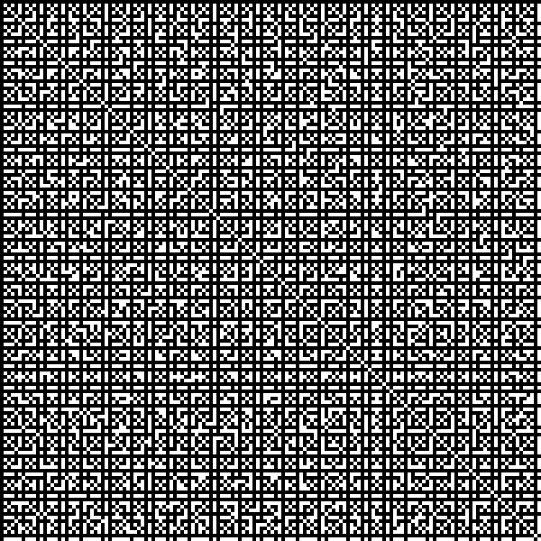

## Coprime integers

Two integers are coprime if they share no prime factors, i.e. their greatest common denominator is 1. ``coprime.c`` calculates all pairs of coprime numbers up to a specified maximum value (100 by default).

    make
    ./coprime
    ./coprime 150

``plot.py`` is an auxiliary script which can be used to visualise the output of ``coprime``. Simply pipe the output of ``coprime`` into ``plot.py``.

    ./coprime 200 | python3 plot.py

``plot.py`` takes an optional argument while scales the size of the output bitmap by an integer scaling factor:

    ./coprime 200 | python3 plot.py 5
    

An example image is shown below for integers from 1 to 150. Rows are numbered 1-150 from top to bottom. Columns are numbered 1-150 from left to right. Cell i,j is marked black if i and j are coprime, or white otherwise.

